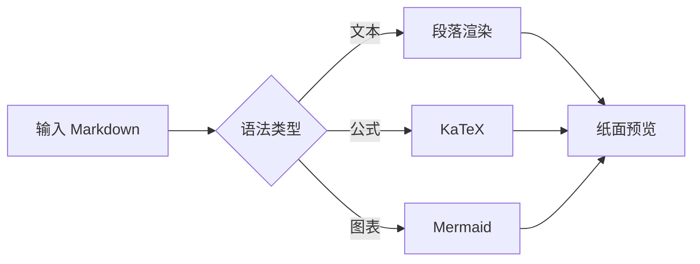
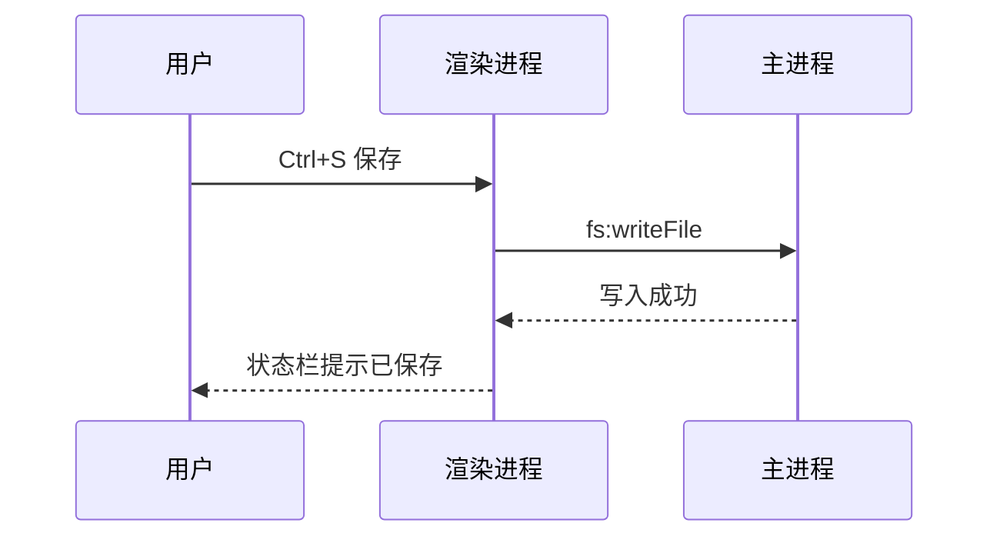
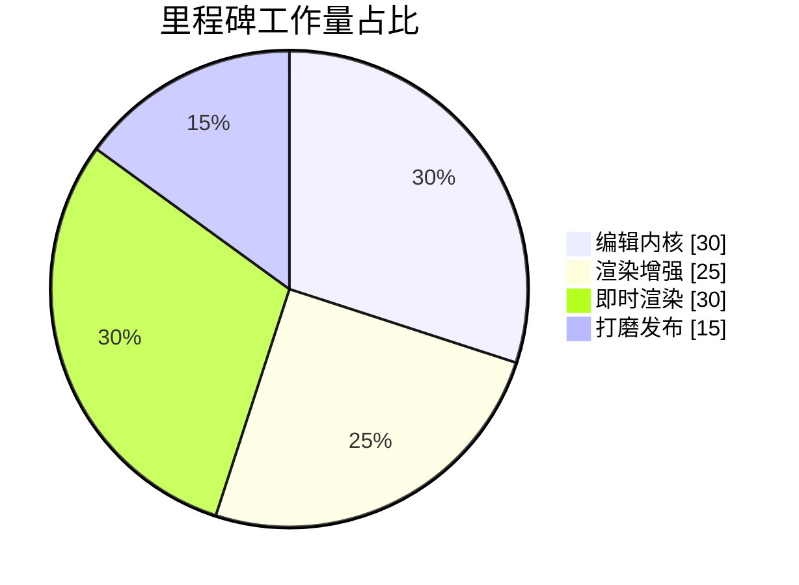

# 墨匣 功能全景示例

> 墨匣纸面 · 落笔即章。这份文档覆盖 墨匣 支持的全部语法类型，
> 打开它就可以逐项检验编辑器与预览的渲染效果。
> 快捷键：`Ctrl+B` 加粗 · `Ctrl+I` 斜体 · `Ctrl+K` 链接 · `Ctrl+=`/`Ctrl+-` 标题升降级 · `Ctrl+F` 查找替换。

---

## 1. 行内元素

一段普通段落里可以混合 **粗体**、*斜体*、~~删除线~~、`行内代码`，以及指向 [墨匣 Inkbox 项目](https://github.com) 的链接。中文排版与 English text 混排时，字距与基线应当自然。

emoji 直接输入即可：✨ 📝 ⌨️ 🧭 ✅

## 2. 标题层级

# 一级标题
## 二级标题
### 三级标题
#### 四级标题
##### 五级标题
###### 六级标题

## 3. 列表

无序列表：

- 墨匣：深色导航脊
- 纸面：悬浮内容卡片
  - 圆角 14px
  - 两段式轻投影
- 琥珀：唯一的点睛色

有序列表：

1. 安装依赖 `npm install`
2. 启动开发 `npm run dev`
3. 构建产物 `npm run build`

任务列表（勾选状态只读展示）：

- [x] 双栏实时预览
- [x] 数学公式与图表
- [ ] 所见即所得（M3）
- [ ] 导出 PDF / Word（M4）

## 4. 引用

> 引用块：左侧琥珀细条 + 淡琥珀底。
>
> > 嵌套引用同样支持，文字转为次级色。

## 5. 代码块（墨块风格）

```js
// 明暗主题下代码块都保持深色"墨块"
export function greet(name) {
  const msg = `你好，${name}！`
  console.log(msg)
  return msg
}
```

```python
def fib(n: int):
    a, b = 0, 1
    for _ in range(n):
        a, b = b, a + b
    return a
```

```json
{
  "app": "墨匣 Inkbox",
  "theme": ["light", "dark", "system"],
  "features": ["math", "mermaid", "outline"]
}
```

```bash
npm install && npm run dev
```

## 6. 表格

| 模块 | 状态 | 负责人 |
| :--- | :---: | ---: |
| 编辑内核 | 已完成 | 前端 |
| 渲染管线 | 已完成 | 前端 |
| 即时渲染 | 进行中 | 前端 |
| 打包分发 | 计划中 | 构建 |

## 7. 数学公式（KaTeX）

质能方程 $E = mc^2$ 与欧拉公式 $e^{i\pi} + 1 = 0$ 可以行内出现。

$$
\int_0^\infty e^{-x^2}\,dx = \frac{\sqrt{\pi}}{2}
$$

$$
\sum_{k=1}^{n} k^2 = \frac{n(n+1)(2n+1)}{6}
$$

价格写法 $100 与 $200 不会被误判为公式。

## 8. Mermaid 图表







## 9. 图片

点击预览中的图片可打开查看器（滚轮缩放 / 拖拽 / Esc 关闭）：


> 本地相对路径图片的自动落盘与管理将在 M3 提供，当前建议使用网络图片或 data URI。

## 10. 分隔线与长文滚动

---

以上各节之间滚动时，左栏源码与右栏预览应当保持块级同步；
把光标放到任意标题上，左侧大纲面板会同步高亮当前小节，
点击大纲条目则可跳转回对应位置。

## 11. 扩展语法

**行内高亮**：写 ==重要内容==，预览里会以琥珀底色标出。

**上下标**：水的化学式 H~2~O，爱因斯坦质能方程之外还有 x^2^ + y^2^ = z^2^。

**脚注**：墨匣是一个本地优先的编辑器[^1]，支持即时渲染[^note]。

**目录**：在文档里单独一行写 `[TOC]`，预览会生成可点击的标题目录：

[TOC]

[^1]: 数据全部保存在本机，不依赖任何云端服务。
[^note]: 即显模式即打即看，公式与图表在源码/双栏模式完整渲染。

祝写作愉快。✨
